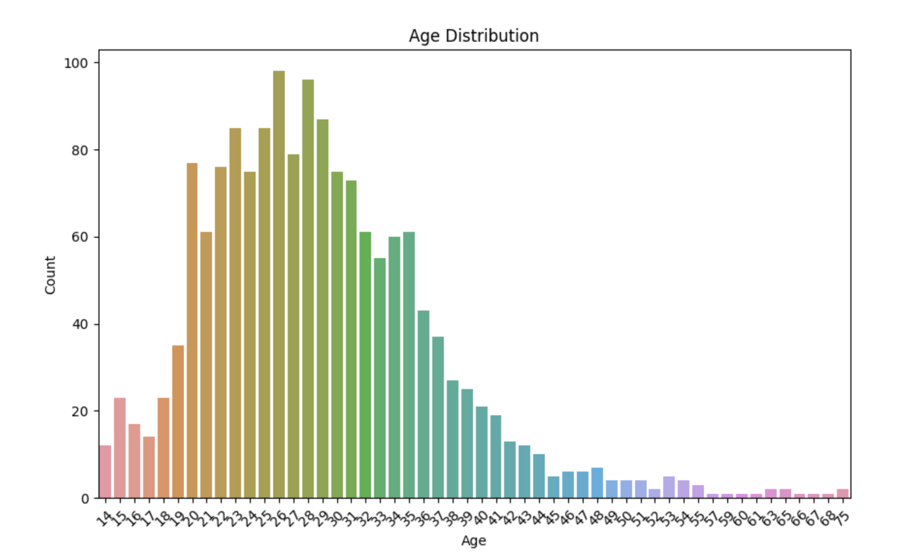

# RunnningPerformance
## BMW Snow Leopard Run 2023 - 5K Runners Analysis

This project involves scraping and analyzing data from the BMW Snow Leopard Run 2023 event held by Nomad Sport in Kyrgyzstan. The focus is on exploring correlations between gender, age, and the time taken by participants to complete the 5km race.


## Table of Contents
- [Introduction](#introduction)
- [Data Scraping](#data-scraping)
  - [Scraped Data](#scraped-data)
  - [Web Scraping Tools](#web-scraping-tools)
  - [Example Code](#example-code)
- [Data Analysis](#data-analysis)
  - [Data Cleaning and Transformation](#data-cleaning-and-transformation)
  - [Visualization](#visualization)
  - [Machine Learning](#machine-learning)
  - [Example Code](#example-code-1)
- [Requirements](#requirements)
- [Usage](#usage)
  - [Data Scraping](#data-scraping-1)
  - [Data Analysis](#data-analysis-1)
- [Results](#results)
- [License](#license)

## Introduction
This project explores the correlation between participants' gender, age, and performance in the BMW Snow Leopard Run 2023 5km event. Using web scraping, we collected data such as participants' names, gender, age, and race completion time. After cleaning and transforming the data, machine learning techniques were applied to analyze these variables.

## Data Scraping
We employed `selenium` and `BeautifulSoup` to scrape participant data directly from the official event results page.

### Scraped Data
The data collected includes the following fields:
- **Name**: Full name of the participant
- **Gender**: Male (М) or Female (Ж)
- **Age**: Age of the participant
- **Time**: Completion time for the 5km race

### Web Scraping Tools
- **`selenium`**: Used to automate interactions with the event results webpage.
- **`BeautifulSoup`**: Used to parse the HTML and extract relevant data from the page.

### Example Code
```python
import csv
from selenium import webdriver
from bs4 import BeautifulSoup
```
## Web Scraping
For full details on the web scraping process, see the [scrape.py](scrape.py) file.

## Data Analysis
After collecting the data, we used various data manipulation and visualization techniques to explore the relationship between age, gender, and race performance.

### Data Cleaning and Transformation
- Converted gender to numeric form for analysis (`М = 1`, `Ж = 0`)
- Extracted numerical values from age and time fields

### Visualization
We utilized `seaborn` and `matplotlib` to generate plots for:
- Age distribution
- Gender distribution
- Scatter plot of Age vs. Time, colored by Gender

### Machine Learning
We applied the K-Nearest Neighbors (KNN) regression model to predict participants' race times based on age and gender.

- **Model**: `KNeighborsRegressor(n_neighbors=5)`
- **Evaluation Metrics**: Mean Squared Error (MSE), R² Score

### Example Code
```python
from sklearn.neighbors import KNeighborsRegressor
```
## Requirements

To run this project, you will need to install the following Python packages:

```bash
pip install selenium beautifulsoup4 pandas numpy scikit-learn matplotlib seaborn
```
## Data Scraping

To scrape the data, run the following script:

```bash
python scrape.py
```

## Data Analysis

To analyze the data and generate visualizations, run:

```bash
python analysis.py
```

## Results

The analysis demonstrated that both age and gender had significant correlations with race times. Visualizations showed clear trends in performance across different demographics.

- **KNN Mean Squared Error**: *Insert MSE value*
- **KNN R² Score**: *Insert R² value*




## License

This project is licensed under the MIT License. See the [LICENSE](LICENSE) file for details.

Updates are on the way
